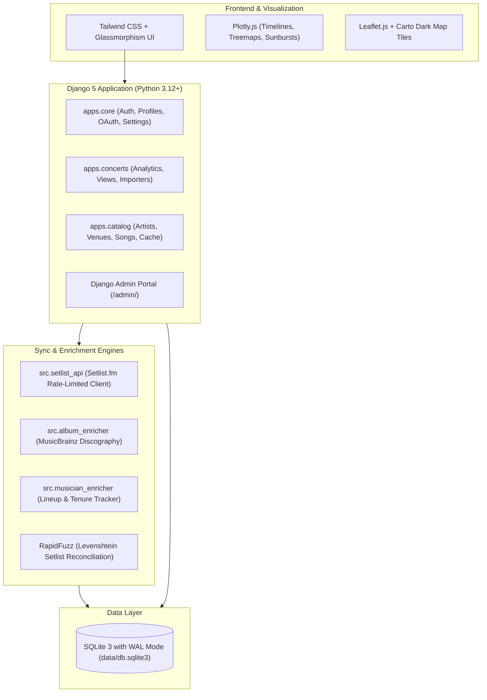

# 🎸 Setlore

[](https://opensource.org/licenses/MIT)
[](https://www.python.org/downloads/)
[](https://www.djangoproject.com/)
[](https://www.docker.com/)

A privacy-first, self-hosted, open-source live concert history tracker and setlist analytics engine. 

**Setlore** is built for live music obsessives who want deep discography insights, musician lineup tenures, interactive venue cartography, and automatic Setlist.fm reconciliation—without locking their personal memories behind third-party paywalls or algorithmic feeds.

---

## ⚡ Key Highlights

- **🔒 100% Self-Hosted & Data-Sovereign**: Zero tracking, zero ads, no paywalled exports. Your entire live music history lives in a portable SQLite database on your own hardware or VPS.
- **🔄 Two-Way Setlist.fm Syncing**: Connect your Setlist.fm account to auto-sync attended concerts, fetch live setlists, and run fuzzy audit reconciliations via [RapidFuzz](https://github.com/rapidfuzz/RapidFuzz) to find missing "I was there" marks.
- **🎫 Multi-Source Ingestion**:
  - **Setlist.fm API**: Automatic rate-limited background sync worker.
  - **Ticketmaster Parser**: Paste raw confirmation emails or ticket text to instantly extract dates, venues, artists, and tour notes.
  - **CSV / Spreadsheet Upload**: Bulk import existing archives with standard headers (`Date`, `Band`, `Venue`, `City`, `Notes`).
  - **Interactive Quick-Add**: Modal with instant venue/artist autocomplete, geocoding, and plaintext setlist paste support.
- **💾 Universal Exportability**: Full CSV downloads available anytime from your dashboard or via public profile endpoints (`/u/<username>/export/`).
- **👥 Musician Lineup & Tenure Tracking**: Knows who was actually on stage. Calculates historical band rosters by concert date, tracking individual drummers, guitarists, and vocalists across all their side projects and supergroups (e.g. Mike Portnoy across Dream Theater, Transatlantic, and The Winery Dogs).
- **💿 MusicBrainz Discography & Eras**: Enriches songs heard live with studio album attributions, release years, cover song flags, and interactive treemaps.
- **🗺️ Interactive Venue Maps**: Leaflet-powered maps visualising all venues, cities, and road trips over the decades with automated geocoding.
- **🌐 Public Vanity Profiles & Social Overlap**: Share your public profile at `/u/@username` or `/u/username`. Compare concert attendance with friends on the same instance to see which shows you attended together.
- **🎛️ Django Admin Superpowers**: Full `/admin/` portal to manage catalog metadata, correct misattributed albums/songs, edit band lineups, and adjust venue coordinates.

---

## 🚀 Quickstart: Docker & Docker Compose (Recommended)

The quickest way to run Setlore is with **Docker Compose**:

### 1. Clone & Configure Environment
```bash
git clone https://github.com/cgarst/concert-trakr.git
cd concert-trakr
cp .env.example .env
```

Edit `.env` with your desired configuration:
```dotenv
# Django Security & Host Settings
DJANGO_SECRET_KEY=generate_a_random_secret_key_here
DEBUG=False
ALLOWED_HOSTS=localhost,127.0.0.1,your-domain.com
CSRF_TRUSTED_ORIGINS=http://localhost:8000,https://your-domain.com

# Initial Superuser Account (Created on startup)
ADMIN_USERNAME=admin
ADMIN_EMAIL=admin@example.com
ADMIN_PASSWORD=change_this_secure_password
SETLISTFM_USER=admin

# External APIs
SETLISTFM_KEY=your_setlistfm_api_key_here
CONTACT_EMAIL=admin@example.com
CARTO_API_KEY=your_carto_api_key_here

# Google OAuth 2.0 (Optional)
GOOGLE_CLIENT_ID=
GOOGLE_CLIENT_SECRET=
GOOGLE_REDIRECT_URI=https://your-domain.com/accounts/google/callback/
```

### 2. Launch Container
```bash
docker compose up -d
```

### 3. Open the App
- **Landing Page**: [http://localhost:8000/](http://localhost:8000/)
- **Concert Dashboard**: [http://localhost:8000/dashboard/](http://localhost:8000/dashboard/) (or `/overview/`)
- **Django Admin**: [http://localhost:8000/admin/](http://localhost:8000/admin/)
- **Data Persistence**: All SQLite database records, uploaded files, and API caches persist in `./data/db.sqlite3` on your host machine.

---

## 🛠️ Local Development Setup (with `uv`)

Dependencies and virtual environments are managed using [Astral uv](https://github.com/astral-sh/uv):

### 1. Prerequisites
- **Python 3.12+**
- **uv** (`pip install uv` or `curl -LsSf https://astral.sh/uv/install.sh | sh`)
- Free [Setlist.fm API Key](https://www.setlist.fm/settings/api) (recommended)

### 2. Install Dependencies
```bash
uv sync
```

### 3. Initialize Database & Seed Superuser
```bash
uv run python manage.py migrate
uv run python manage.py seed_user_one
uv run python manage.py collectstatic --noinput
```

### 4. Start Development Server
```bash
uv run python manage.py runserver 8000
```
Visit `http://localhost:8000/` in your browser.

---

## 📥 Ingestion & Import Formats

### 1. CSV Spreadsheet Format
When importing a CSV, Setlore looks for standard header columns (case-insensitive):

| Column Header | Required | Example / Description |
| :--- | :--- | :--- |
| **Date** | Yes | `MM/DD/YYYY`, `YYYY-MM-DD`, or `DD-MM-YYYY` (e.g. `10/22/2024`) |
| **Band** / **Artist** | Yes | Artist name or comma/slash-separated acts (e.g. `Dream Theater` or `Iron Maiden, Dio`) |
| **Venue** | Recommended | Venue name (e.g. `The Anthem` or `Red Rocks Amphitheatre`) |
| **City / State** | Optional | Location details (e.g. `Washington, DC` or `Morrison, CO`) |
| **Notes / Tour** | Optional | Tour names or notes (e.g. `40th Anniversary Tour`) |

### 2. Ticketmaster Email / Order Parser
Navigate to your dashboard menu &rarr; **Import Ticketmaster** and paste raw text from order confirmations or ticket emails. Setlore extracts the event date, primary artist, venue, location, and queries Setlist.fm to match setlists.

### 3. Setlist.fm Live Sync
Enter your Setlist.fm username in **Profile & Privacy** to trigger live background syncing. Setlore pulls attended shows, setlist songs, and flags unlinked events.

---

## 📤 Universal Data Export

Setlore believes in complete data portability:
- **Dashboard CSV Export**: Click **Export CSV** in the user menu or mobile actions sheet.
- **Public Profile Export**: Append `/export/` to any public profile URL (e.g., `/u/username/export/` or `/@username/export/`) to download their concert archive in CSV format.
- **Raw SQLite Database**: Your entire dataset is stored in `./data/db.sqlite3` for trivial backup, migration, or external querying.

---

## 🏗️ Architecture & Tech Stack



- **Backend**: Python 3.12+, Django 5.x (MVC architecture, custom CaseInsensitiveModelBackend).
- **Database**: SQLite 3 with Write-Ahead Logging (`PRAGMA journal_mode=WAL`) and persistent caching tables (`catalog.ApiCache`).
- **Enrichment**: Setlist.fm REST API, MusicBrainz API (rate-limited to 1 req/sec), RapidFuzz C++ string distance matching.
- **Visualization**: Plotly.js 2.27, Leaflet 1.9, Carto dark tile layers.
- **Deployment**: Docker, Docker Compose, WhiteNoise static file serving.

---

## ⚙️ Environment Variables

| Variable | Default | Purpose |
| :--- | :--- | :--- |
| `DJANGO_SECRET_KEY` | *(insecure default)* | Secret key for Django cryptographic signing |
| `DEBUG` | `False` | Set to `True` for local debugging |
| `ALLOWED_HOSTS` | `localhost,127.0.0.1` | Comma-separated list of valid host headers |
| `CSRF_TRUSTED_ORIGINS` | `http://localhost:8000` | Comma-separated origins for CSRF protection |
| `DATA_DIR` | `data` | Base directory for database and file persistence |
| `DATABASE_PATH` | `data/db.sqlite3` | Path to host SQLite database file |
| `SETLISTFM_KEY` | `""` | Global Setlist.fm API key for syncing |
| `SETLISTFM_USER` | `""` | Default Setlist.fm username fallback |
| `CONTACT_EMAIL` | `admin@localhost` | Contact email header for MusicBrainz rate-limited API calls |
| `CARTO_API_KEY` | *(public key)* | Optional custom CARTO map tiles API key |
| `GOOGLE_CLIENT_ID` | `""` | Optional Google OAuth Client ID for 1-click login |
| `GOOGLE_CLIENT_SECRET`| `""` | Optional Google OAuth Client Secret |
| `GOOGLE_REDIRECT_URI` | `""` | Optional Google OAuth Redirect Callback URL |

---

## 🧪 Running Tests

Execute the full automated test suite:

```bash
uv run python manage.py test tests
```

---

## 📄 License

Setlore is distributed under the open-source **[MIT License](LICENSE)**. Feel free to self-host, customize, and contribute!
